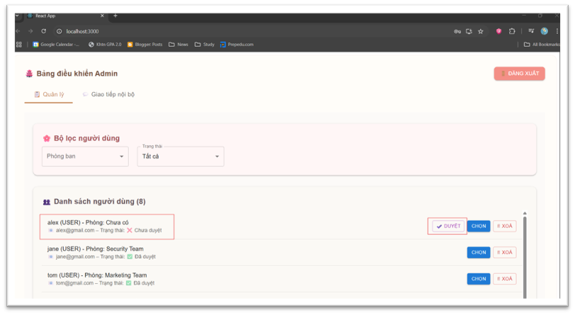
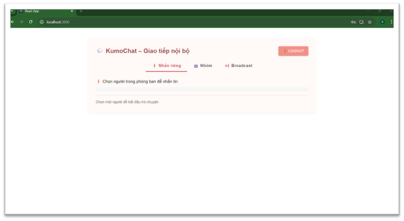
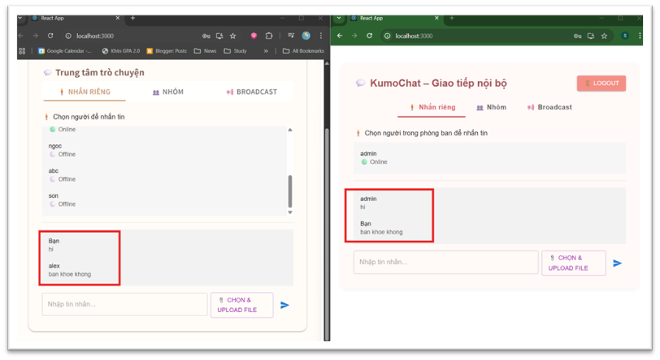
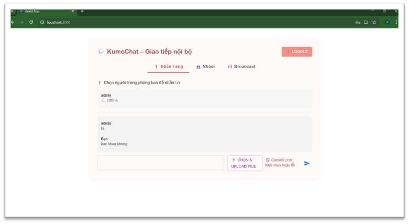

<h1 align="center">💬 KumoChat – Hệ thống trò chuyện nội bộ mã hóa đầu cuối</h1>

<p align="left">
  <em>Đây là đồ án cá nhân trong môn Đồ án Mã hóa Ứng dụng & An ninh Thông tin. Thực hiện trong 2 tháng (lên ý tưởng, thiết kế, triển khai và thử nghiệm).</em><br>
</p>

---

## 🧠 Chia sẻ cá nhân

- ✅ **Mức độ hoàn thành**: Tuy còn một vài thiếu sót như: giao diện tương tác của người dùng chưa được tối ưu (hiển thị các alert gây bất tiện), kiểm tra file upload còn chậm và chưa an toàn tuyệt đối. Nhưng nhìn chung dự án đã hoàn thiện đầy đủ tính năng theo mục tiêu ban đầu. Giao diện hoạt động ổn định, backend xử lý realtime và mã hóa hiệu quả, có khả năng triển khai thực tế trong môi trường nội bộ.

- 🧩 **Kinh nghiệm tích lũy**:
  - Thiết kế hệ thống có tích hợp bảo mật: mã hóa đầu cuối, kiểm tra tệp, phân quyền người dùng.
  - Triển khai realtime chat sử dụng Socket.IO kết hợp logic kiểm soát truy cập.
  - Làm quen với quy trình thiết kế API REST, phân tách frontend/backend rõ ràng, và xử lý tương tác dữ liệu thời gian thực.
  - Debug nâng cao: xử lý lỗi đồng bộ hóa, lỗi mã hóa/giải mã, xác thực JWT.

- 📘 **Kiến thức học được**:
  - Mã hóa lai (Hybrid Encryption): cách kết hợp AES (tốc độ) và RSA (bảo mật khóa).
  - Xử lý tệp an toàn: tích hợp ClamAV và VirusTotal vào quy trình upload.
  - Quản lý vai trò và phòng ban: xây dựng hệ thống RBAC (Role-Based Access Control).
  - Kỹ năng sử dụng Prisma ORM và tối ưu truy vấn dữ liệu PostgreSQL.

---

## 📌 Giới thiệu dự án

**KumoChat** là một hệ thống trò chuyện nội bộ bảo mật, hỗ trợ ba chế độ giao tiếp: nhắn tin riêng tư, nhắn nhóm theo phòng ban, và phát sóng từ quản trị viên đến toàn bộ người dùng.  
Ứng dụng sử dụng mã hóa đầu cuối kết hợp AES và RSA để bảo vệ nội dung tin nhắn, đồng thời tích hợp ClamAV và VirusTotal để quét virus cho tập tin trước khi tải lên.

Quản trị viên có thể phê duyệt tài khoản, tạo phòng ban và phân quyền vai trò. Giao diện được xây dựng bằng React, hỗ trợ cập nhật thời gian thực thông qua Socket.IO.

---

<h3>🖥️ Giao diện của Admin</h3>
<p align="center">
  
</p>

<h3>🖥️ Giao diện của User</h3>
<p align="center">
  
</p>

<h3>🖥️ Giao diện chat riêng tư</h3>
<p align="center">
  
</p>

<h3>🖥️ Giao diện kiểm tra file upload</h3>
<p align="center">
  
</p>

---

## 🛠️ Công nghệ sử dụng

- **Backend**: Node.js, Express, PostgreSQL  
- **Frontend**: React, Socket.IO, Material UI (MUI)  
- **ORM**: Prisma  
- **Realtime**: Socket.IO  

---

## 🔐 Các tính năng bảo mật

- **Xác thực**: JSON Web Token (JWT)  
- **Mã hóa đầu cuối**: AES (dữ liệu) + RSA (trao đổi khóa) + SHA (đảm bảo toàn vẹn dữ liệu)
<p align="center">
  
</p>

- **Quét tệp**: ClamAV và VirusTotal tích hợp  

---

## ✨ Tính năng nổi bật

### 👥 Quản lý người dùng
- Đăng ký / đăng nhập tài khoản
- Admin phê duyệt tài khoản, tạo phòng ban, gán vai trò

### 💬 Nhắn tin
- Nhắn tin riêng giữa các người dùng trong cùng phòng ban
- Nhắn tin nhóm nội bộ theo phòng ban (mã hóa bằng khóa AES dùng chung)
- Admin phát tin nhắn đến toàn bộ người dùng (chỉ đọc)

### 📎 Quản lý tệp đính kèm
- Quét virus trước khi tải lên bằng ClamAV & VirusTotal

### 🔐 Kiểm soát truy cập
- Phân quyền vai trò: **User**, **Leader**, **Admin**

---

## 📁 Xem báo cáo & hình ảnh

Bạn có thể xem báo cáo chi tiết và ảnh chụp màn hình trong thư mục [`/report`](./report).

---

## 🚀 Khởi chạy ứng dụng cục bộ
```bash
1. Clone repo
    git clone https://github.com/yourusername/kumochat.git
    cd kumochat

2. Backend setup
    cd backend
    npm install
    npx nodemon src/server.js

3. Frontend setup
    cd ../frontend
    npm install
    npm start
